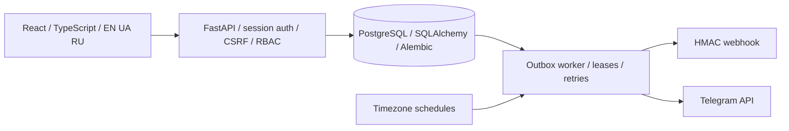
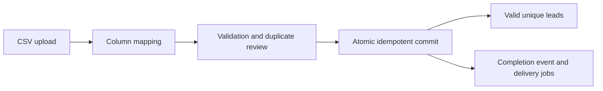
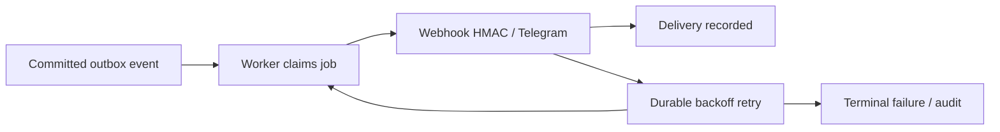
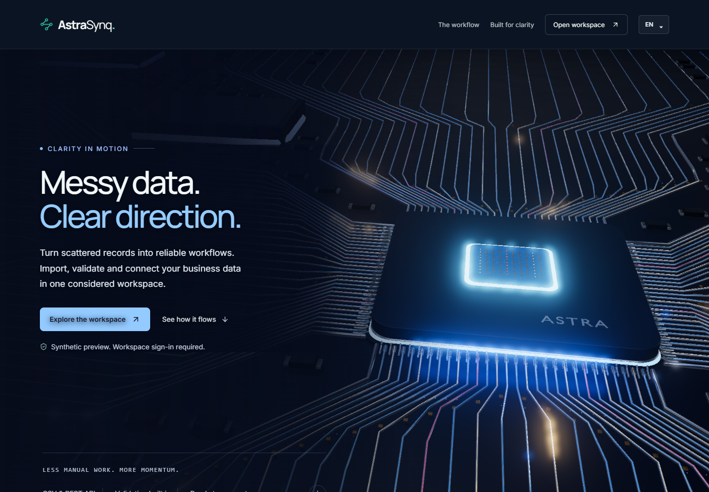
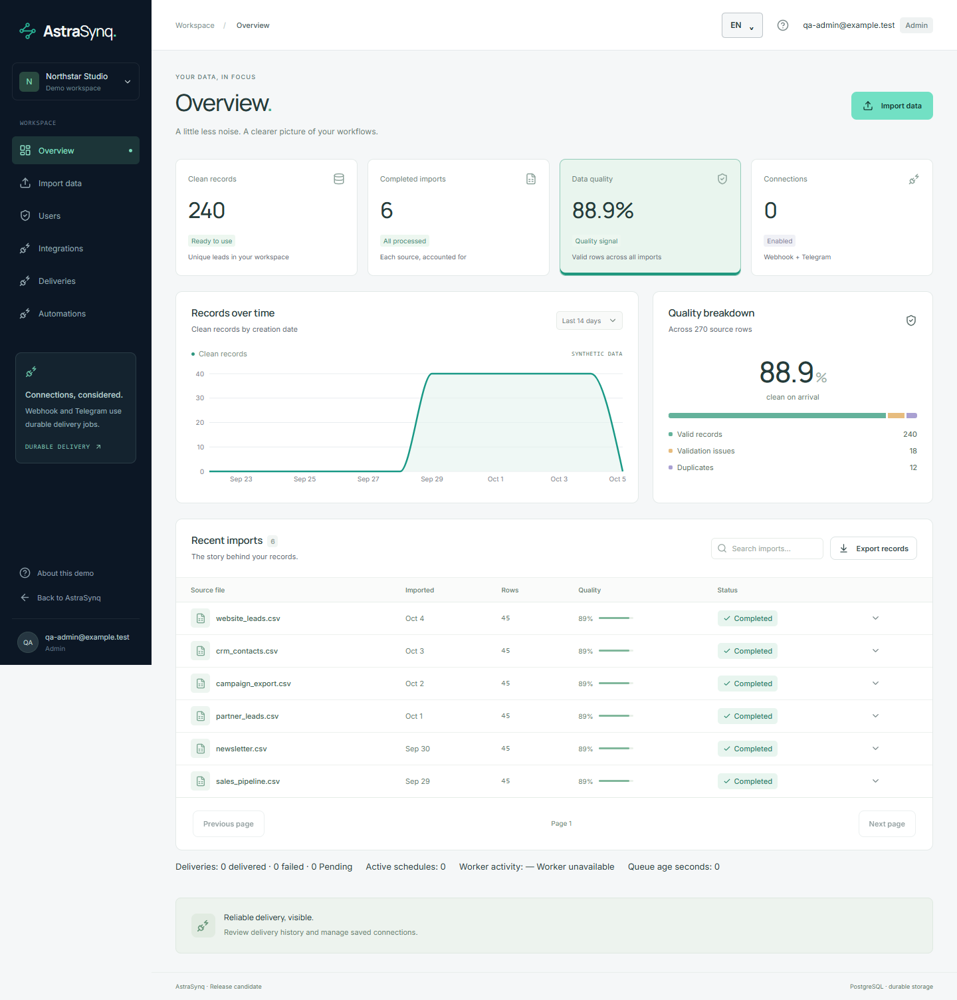
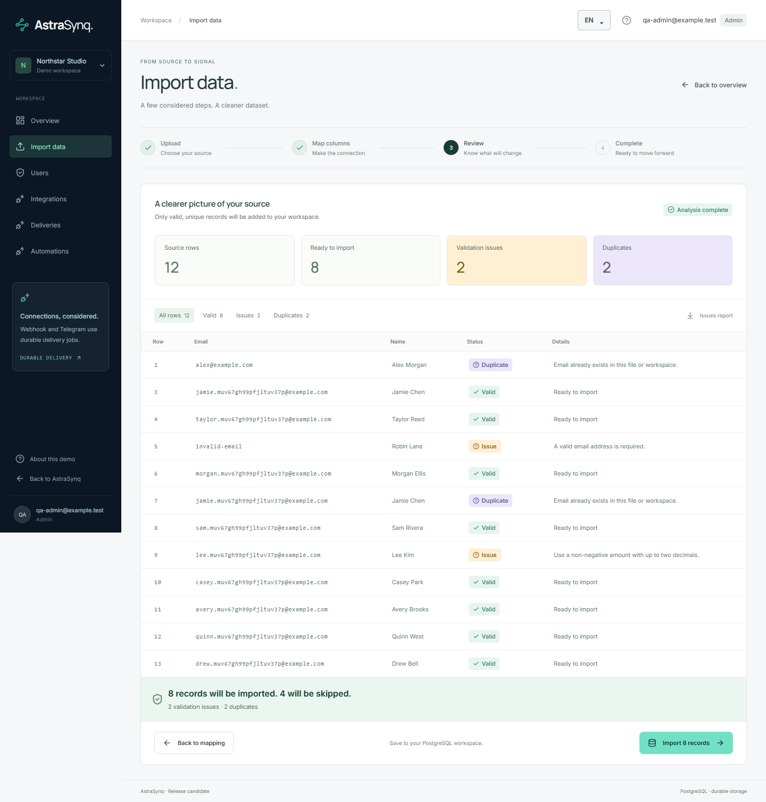
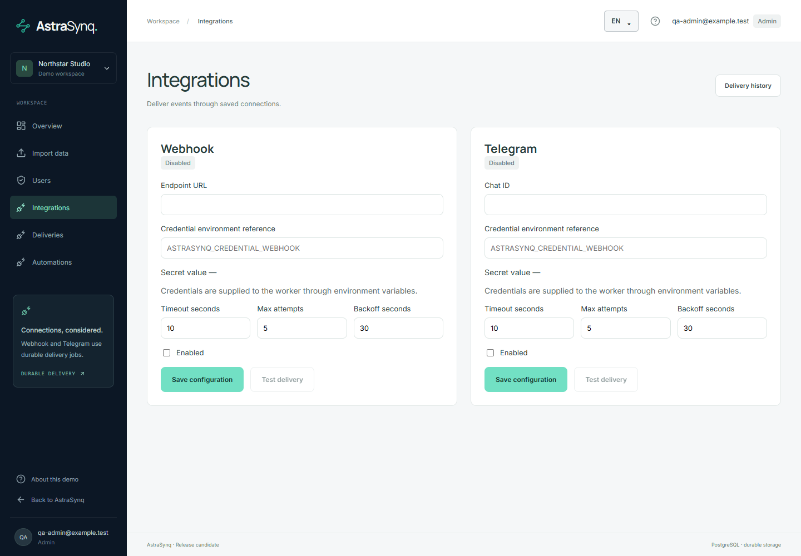
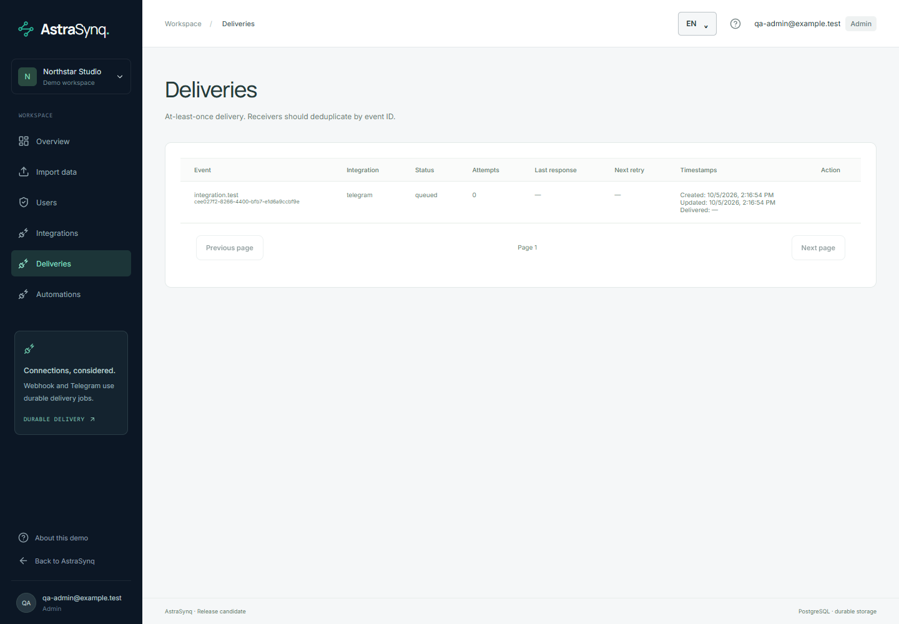
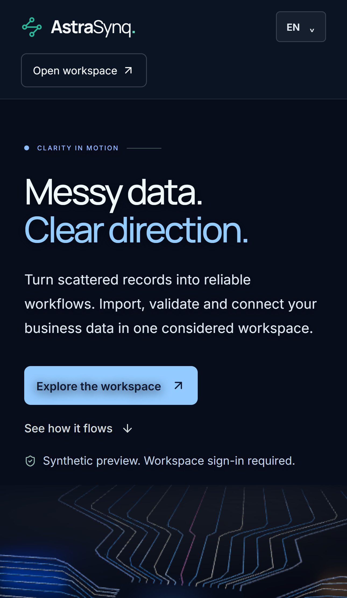

# AstraSynq — Data Automation & Integration Platform

**0.5.0-rc.1 · Local Release Candidate.** A portfolio project for validating CSV data and delivering durable automation events. Production deployment and public release are pending.

FastAPI · React · TypeScript · PostgreSQL · SQLAlchemy/Alembic · Auth/RBAC · CSV validation and deduplication · outbox/worker/retries · Webhook HMAC · Telegram · timezone schedules · EN/UA/RU · immersive WebGL landing.

## Architecture



## Import lifecycle



The commit writes leads, completion event and delivery jobs in one transaction. Session authentication uses Argon2id passwords, HttpOnly cookies and per-session CSRF. Viewer, Operator and Admin permissions are enforced by the backend.

## Event delivery



Delivery is **at-least-once**. A remote acceptance followed by a worker crash can repeat effects. Webhook receivers should deduplicate stable event IDs; Telegram messages may repeat. Outgoing webhook validation rejects private destinations by default, verifies TLS and disallows redirects.

## Screenshots

All curated captures use synthetic test data and omit browser chrome. Mobile screenshots are browser emulation; they are not physical-device evidence.








## Local development

Windows, Python 3.12, Node.js 24, pnpm 11.25.0 and PostgreSQL 16 are the tested local tools. Run commands from your checkout; the project has no default administrator or shared login password.

```powershell
python -m venv .venv
./.venv/Scripts/python.exe -m pip install -r backend/requirements-dev.txt
pnpm --dir frontend install --frozen-lockfile
# Optional: Copy-Item .env.example .env
# Loopback defaults work without .env; use environment variables for custom settings.
./scripts/start-local.ps1 -ExistingPostgres -SkipInstall
```

Provide a local PostgreSQL service and separate `astrasynq` / `astrasynq_test` databases, or use the Windows development-only provisioner `./.venv/Scripts/python.exe scripts/setup-postgres.py`. Its loopback development authentication must not be used for production. Start the first administrator from `backend` with `../.venv/Scripts/python.exe -m app.bootstrap_admin`; the password is prompted privately. The launcher starts API, frontend and worker. Stop the app with `./scripts/stop-local.ps1`.

For portable development, install the same Python requirements and frontend lockfile, supply private `DATABASE_URL`, run `alembic upgrade head` from `backend`, then run `uvicorn app.main:app`, `python -m app.worker` and `pnpm dev` in separate terminals. Configure the frontend API URL and matching allowed origins. Docker configuration is present; Docker runtime verification remains pending.

## Verification and device QA

See [final verification](docs/verification.md) for exact counts and warnings from the current release-preparation run, and [CI](docs/CI.md) for the distinction between portable smoke checks and local GPU/device checks.

Desktop Chrome and **iPhone 14 Pro Max / Safari real-device QA: PASS**. iPhone status is the owner's supplied device result. **Physical Android Chrome: UNVERIFIED / pending**; no Android device was available. Responsive emulation does not replace a physical Android test.

## Security and limitations

This is a locally tested release candidate. Production TLS/proxy configuration, SCRAM/database permissions, outbound network controls, external secret management, distributed login limiting and deployment/restore drills require environment-specific validation. Physical Android QA and Docker runtime are pending. Large WebGL bundles and GPU-dependent cadence remain practical limitations.

Credentials are supplied privately to worker environment references. Do not commit real environment values, PostgreSQL data, sessions, dumps, logs, cookies, internal QA reports or temporary work directories. Use synthetic samples only. See [security](docs/SECURITY.md), [architecture](docs/architecture.md), [deployment](docs/DEPLOYMENT.md), [public/private split](docs/PUBLIC_RELEASE.md), [dependencies](docs/DEPENDENCIES.md) and [asset provenance](docs/ASSET_PROVENANCE.md).

Original project code and owner-confirmed original assets are licensed under [MIT](LICENSE). Third-party code, fonts and derived environments retain their own licenses; see [THIRD_PARTY_NOTICES](THIRD_PARTY_NOTICES.md).
# Live demo preparation (draft)

A synthetic, invitation-only deployment is prepared locally; no live demo URL is published yet. See [Live demo guide](docs/LIVE_DEMO.md) and [hosting research checked 2026-10-05](docs/HOSTING_RESEARCH.md). The demo uses sample-only imports and simulated deliveries; it does not operate a persistent production worker. Deployment and code publication require owner approval.
