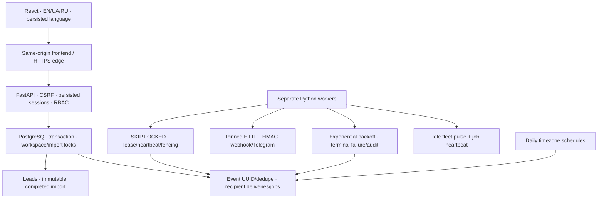

# Architecture · AstraSynq 0.5.0-rc.1

## Storage/schema

SQLAlchemy 2 → psycopg 3 → actual PostgreSQL. No SQLite/in-memory/create_all fallback. Alembic: 6d131c25bdd2 imports → a3auth0000001 auth/audit → a4outbox000001 automation → a5release00001 worker_heartbeats. UUID, UTC timestamptz, JSONB source/canonical data, enforced FK/unique/check constraints. Migrate once before startup; ready requires exact head; pool_pre_ping replaces broken connections.

## Import/concurrency

Upload validates/persists source → mapping clears old analysis → analysis persists classifications/field-code issues → review → commit rechecks under workspace/import locks. Stale review persists refresh + returns 409. Global normalized email uniqueness protects across processes/workspaces; late collision rolls back whole insertion savepoint. Global dedupe is inherited MVP limitation/presence signal across scopes; future tenancy policy separate.

Commit leads/import/event/deliveries/jobs together before HTTP success. Repeat completed commit original count. Four concurrent imports and API termination during/after commit tested. At 10,000 rows analysis/commit/export synchronous/full preview in memory: size CPU/memory/edge budgets for hosting.

## Auth/localization

Argon2id, opaque cookie, DB token hash, per-session CSRF/origin check; membership gives server workspace/role every request. Viewer reads, Operator imports/tests/retries, Admin manages. Role change revokes sessions, last active admin protected. Browser persists language/active import ID only; no session/password localStorage. EN default, Ukrainian uk shown UA, RU; Intl locale display/UTC storage; switches preserve wizard state.

## Worker/transport/schedules

Unique event dedupe and event/integration delivery graph. Recipients selected at transaction time; sending uses current saved destination. One job per worker, SKIP LOCKED multiple processes. Lease60s, heartbeat10s, token+expiry fenced writes. Durable capped exponential retries/budget, manual retry resets job budget but keeps lifetime attempts/event UUID. Failed/paused visible/audited.

At-least-once after accepted HTTP/crash; mandatory receiver UUID dedupe, Telegram no guarantee. Pinned public-IP TLS with host SNI/certificate, no redirect/proxy; timestamp/event/body HMAC; private env references. Daily 09:00 timezone/DST, coalesced missed runs, due timestamp dedupe, trailing24h summary. No real external send during QA.

## Operations

API live DB-independent; ready DB/schema, not worker prerequisite. Idle fleet pulses separate from running job heartbeat. Existing scoped metrics expose failures/due age/expired leases/fleet availability. JSON logs correlate request/job without secrets.

Operator bounded retention only old fully successful histories; import dedupe tombstones permanent; active/failed/paused survive. Lead/import/source/audit provenance deliberately indefinite, monitor storage. Temporary spools request/process lifetime. Exact settings/limits: DEPLOYMENT.md. No SaaS/new feature/deployment/publication added.
